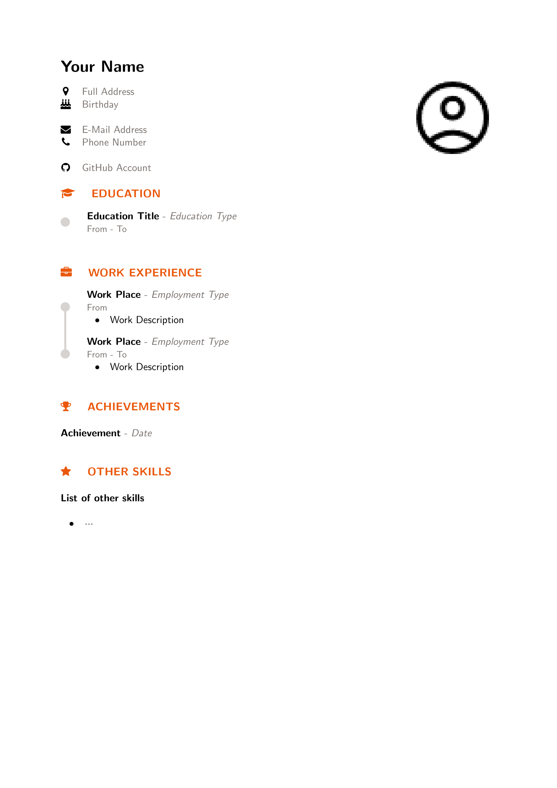

# LaTeX CV
A LaTeX Documentclass for writing a CV.

## Installation
### Getting Started
- Clone this Repository with
```sh
git clone https://github.com/JensOstertag/latex-cv
```
This will clone the Repository into your current Working Directory and create all the mandatory Files.

Your Project Folder will look like this:
```
Project_Folder
  ╟─  img
  ║      ╙─  avatar.png
  ╟─  sections
  ║      ╟─  achievements.tex
  ║      ╟─  education.tex
  ║      ╟─  skills.tex
  ║      ╙─  work.tex
  ╟─  cv.cls
  ╙─  main.tex
```

### Compiling the Document
To compile the Document to a PDF File, open the ``main.tex`` file with a LaTeX Editor and compile it two or three Times. The multiple Compilations are necessary because there are temporary Files that are generated while the Document is generated for the first Time.

The compiled Document will look roughly like this:
| Document Preview                        |
|:---------------------------------------:|
|  |
The CV is highly customizable, so you're not limited to the Sections that you get to see here.

### Customize the Content
#### Personal Information
The CV contains a Field at the Top of the Document for your personal Information. You can modify that in the ``main.tex`` File.
You need to set the following Values:
| Value Description | Command to set the Value   |
|:------------------|:---------------------------|
| Name              | \cvName{NAME}              |
| Full Address      | \cvAddress{ADDRESS}        |
| Date of Birth     | \cvBirthday{DATE OF BIRTH} |
| E-Mail Address    | \cvEmail{E-Mail Address}   |
| Phone Number      | \cvPhone{Phone Number}     |
Note that your E-Mail Address will be displayed as a clickable Link to directly send an E-Mail to you.

Additionally, you can set the following Values that will only be displayed if they are set:
| Value Description | Command to set the Value   |
|:------------------|:---------------------------|
| GitHub Account    | \cvGithub{GITHUB ACCOUNT}  |

#### Image
Currently, there's only an Icon shown in the top right Corner of the Document. You can add a Picture of yourself by overriding the ``avatar.png`` Picture within the ``img`` Directory.

#### Sections
Currently, there are Sections for your Education, Work Experience, Achievements and Other Skills. You can add a Section by adding the following Line in the ``main.tex`` File
```latex
\section{\faPencil \hspace{1em} Section Name}{section}
```
and modifying it to your Needs:
- You might want to replace ``\faPencil`` by a different Fontawesome Icon
- Edit the Section Name (``Section Name``)
- Edit the Name of the File within the ``sections`` where the Content for this Section can be found (``section``)

#### Section Content
To ensure a better Overview within your Main Document File, all Sections are outsourced into separate Files that are located in the ``sections`` Directory.

To edit the Content of a specific Section, you need to know which File contains that Section's Content. You can find that out by looking at the second Argument of the ``\section`` Command (let's assume that was "my-section", then the according File would be ``sections/my-section.tex``).

For an Example of the Possibilities that you have in the Sections, take a Look at this Example that renders the "Work Experience" Block in the Document above:
```latex
\begin{cv-item-list}
	\begin{cv-item}{work-item-name-1}
	  \itemDescriptionDate{Work Place}{Employment Type}{From}{}
		\itemDetail{Work Description}
	\end{cv-item}

	\begin{cv-item}{work-item-name-2}
	  \itemDescriptionDate{Work Place}{Employment Type}{From}{To}
		\itemDetail{Work Description}
	\end{cv-item}
\end{cv-item-list}
```
The ``cv-item`` Environment is used to create the Timeline Points at the Side of the Items. If you don't want them, you can simply leave those Environments out. The ``cv-item-list`` on the other Hand should never be ignored. It's used to separate the CV Items from each other. Technically speaking, it prevents ``tikz`` from connecting Timeline Items of different Sections.

The ``\itemDescriptionDate`` Command can be used to display Items in a predefined Style. The first Argument is the Item's Title and will be printed bold, the next one a specifying Description that is rendered as gray and italic Text. The next two Arguments are used to show when an Activity has started and when it had ended. If an Activity is still ongoing, you can leave the second Argument empty.
